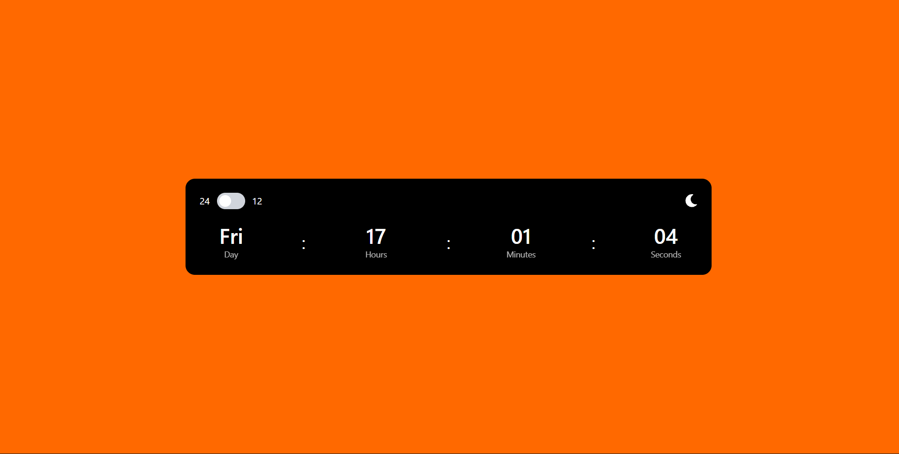

# React Digital Clock

A responsive digital clock built with **React** and **Tailwind CSS**.  
It supports **12 / 24-hour format**, **light & dark themes**, and updates in real time.

---

## Features

- Real-time clock (updates every second)
- Light / Dark theme toggle
- 12-hour & 24-hour format switch
- Fully responsive (mobile, tablet, desktop)
- Dynamic day display
- Styled with Tailwind CSS
- Built using React Hooks

---

## Tech Stack

- **React**
- **Tailwind CSS**
- **React Icons**
- **JavaScript (ES6+)**

---

## Preview




---

## Installation

1. **Clone the repository**
   ```bash
   git clone https://github.com/Muthu404200/Digital-Clock-React-js-tailwind-css.git

2. **Navigate to the project directory**

   ```bash
   cd react-digital-clock
   ```

3. **Install dependencies**

   ```bash
   npm install
   ```

4. **Start the development server**

   ```bash
   npm run dev
   ```


---

## How It Works

* Uses `useState` to manage:

  * Current time
  * Theme (light/dark)
  * Time format (12/24)
* Uses `useEffect` with `setInterval` to update the time every second
* Tailwind CSS handles responsive layout and styling

---

## 🧠 Improvements You Can Add

* 🌍 Multiple time zones
* ⏲ Stopwatch / Timer
* 🎞 Smooth animations
* 💾 Save theme preference using `localStorage`

---

## 🧑‍💻 Author

**Muthu**

* GitHub: [your-username](https://github.com/Muthu404200)

---
